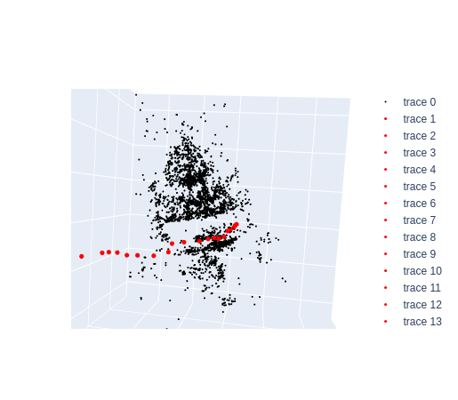

# Incremental Structure-from-Motion (SfM) Pipeline

A Python-based incremental SfM pipeline that reconstructs 3D scene geometry and camera poses from a sequence of 2D images, combining classical multi-view geometry with nonlinear graph optimization using GTSAM.

**Authors:** Varun Samala · Christopher Adu  
**Course:** Advanced Computer Vision — Northeastern University  
**Stack:** Python, OpenCV, GTSAM, Open3D, Plotly, NumPy

---

## Pipeline

```
Image Sequence
      │
      ▼
Preprocessing (Grayscale + CLAHE)
      │
      ▼
SIFT Feature Detection + Non-Max Suppression
      │
      ▼
Feature Matching (Lowe's Ratio Test, adaptive threshold)
      │
      ▼
Essential Matrix Estimation (RANSAC, p=0.999, threshold=1.0px)
      │
      ▼
Pose Recovery (Manual SVD decomposition of E → R, t)
      │
      ▼
Initial Triangulation + Depth Filtering
      │
      ▼
Incremental Pose Extension (solvePnPRansac)
      │
      ▼
Track Management (3D landmarks + 2D observations)
      │
      ▼
GTSAM Bundle Adjustment (Levenberg-Marquardt)
      │
      ▼
3D Point Cloud + Camera Poses
```

---

## Implementation Highlights

- SIFT with 1,000 features for initialization; 5,000 for subsequent views to sustain track continuity
- Non-max suppression on top of SIFT to reduce keypoint clustering by response-ranked spatial filtering
- CLAHE preprocessing for robust feature extraction on low-contrast regions
- Essential matrix pose recovery via **manual SVD decomposition** — all four (R, t) candidates evaluated explicitly with cheirality selection, rather than delegating to `cv2.recoverPose`
- GTSAM factor graph with `GenericProjectionFactorCal3_S2` reprojection factors, camera pose prior, and landmark prior to fix scale

---

## Results

**Two-view initialization**


**Before GTSAM optimization**


**After Levenberg-Marquardt optimization**


---

## Repository Structure

```
.
├── buddha_images/                  # Input image sequence (Buddha statue)
├── sfm.py                          # Main pipeline (~1,046 lines)
├── structure_from_motion.ipynb     # Experimental notebook
├── FIrst_test.png                  # Two-view initialization result
├── prior optimisation.png          # Pre-optimization point cloud
├── Optimised plot.png              # Post-optimization point cloud
├── Optimised plot 1.png            # Alternative post-optimization view
└── README.md
```

| Class | Responsibility |
|---|---|
| `SfmHelpers` | Preprocessing, feature matching, essential matrix, triangulation, PnP |
| `TrackManager` | 3D landmark storage, 2D observations, camera pose management |
| `Plotter` | Plotly / Matplotlib / Open3D visualization and `.ply` export |
| `GtsamOptimiser` | GTSAM factor graph construction and bundle adjustment |

---

## Setup

```bash
pip install numpy opencv-python matplotlib plotly open3d
conda install -c conda-forge gtsam
```

```bash
git clone https://github.com/ChristopherAdu/Structure_SFM_Motion.git
cd Structure_SFM_Motion
python sfm.py
```

To run on a different image sequence, update `path_to_images` in `main()`. Images must be ordered sequentially.

---

## Limitations

- Camera intrinsics use a fixed approximation (`fx = fy = 1500`) rather than calibrated values
- Consecutive-pair processing only — no view graph or loop closure
- PnP falls back to identity pose if fewer than 6 correspondences are found for a new view

---

## References

- Hartley, R. & Zisserman, A. (2004). *Multiple View Geometry in Computer Vision*. Cambridge University Press.
- Agarwal, S. et al. (2011). Building Rome in a Day. *Communications of the ACM, 54*(10).
- Dellaert, F. et al. GTSAM: [https://gtsam.org](https://gtsam.org)
- Lowe, D.G. (2004). Distinctive Image Features from Scale-Invariant Keypoints. *IJCV, 60*(2).
